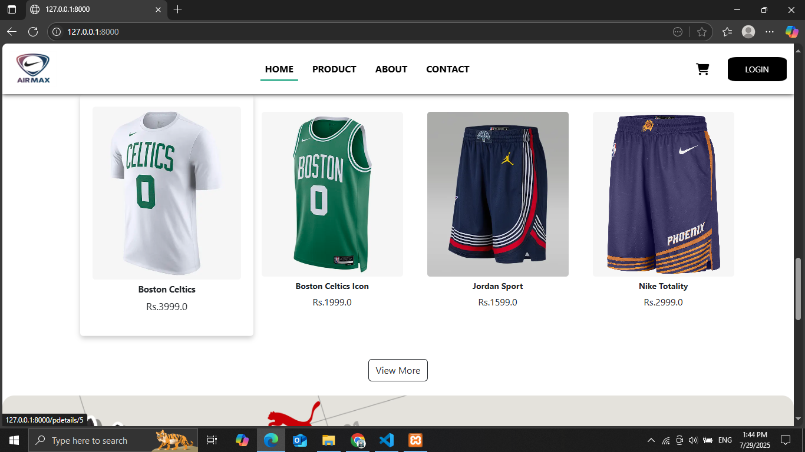
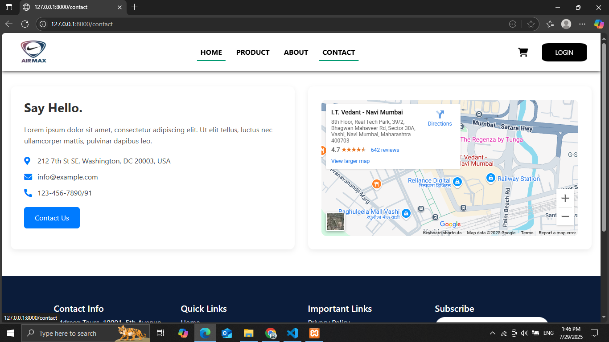
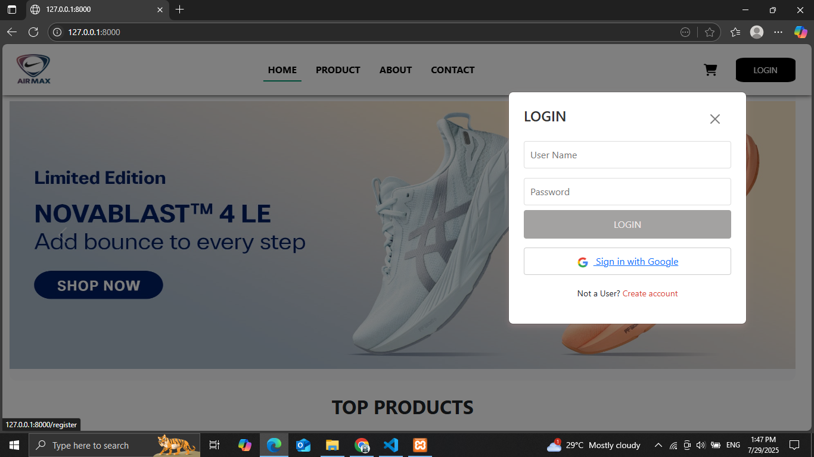

# 👟 Air Max E-commerce Website

Welcome to the **Air Max E-commerce Website** project – a fully responsive online shopping platform built to showcase trendy and performance-oriented footwear. This project is designed to provide users with a seamless shopping experience featuring product listings, filters, cart management, and a modern UI.

## 🛠️ Tech Stack

- **Frontend:**
  - HTML5
  - CSS3
  - JavaScript 
  - Bootstrap 5 (for responsive design and components)

- **Backend :**
  - Python with Django
  - SQLite / MySQL (for database)
  - Django Authentication System (User login, register, cart storage)

## 📌 Features

- 👟 Product Listings with images, prices, and categories
- 🔍 Filter modal for product category filtering
- 🛒 Add to Cart and View Cart functionality
- 📱 Fully Responsive Design (Mobile & Desktop)
- ✨ Clean and modern UI inspired by Nike Air Max series
- 🔐 (Optional) User Authentication: Login/Register
- 🧾 (Optional) Order Summary & Checkout page

## 📸  Screenshots

### 🏠 Home Page

### ℹ️ About Page

### 📞 Contact Page

### 🔐 Login Page

### 📝 Register Page

### 🛍️ Product Listing

### 🔍 Product Search

### 🛒 Cart Page

### 💳 Payment Page

